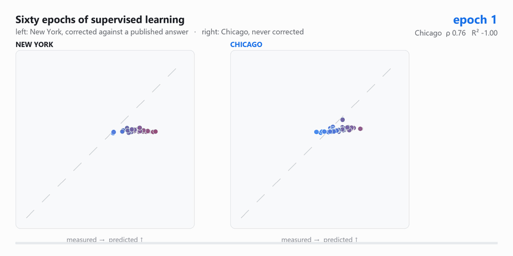
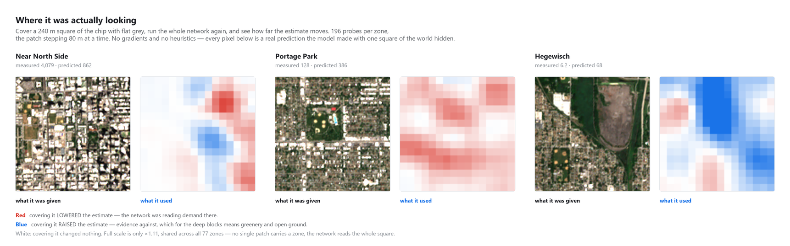
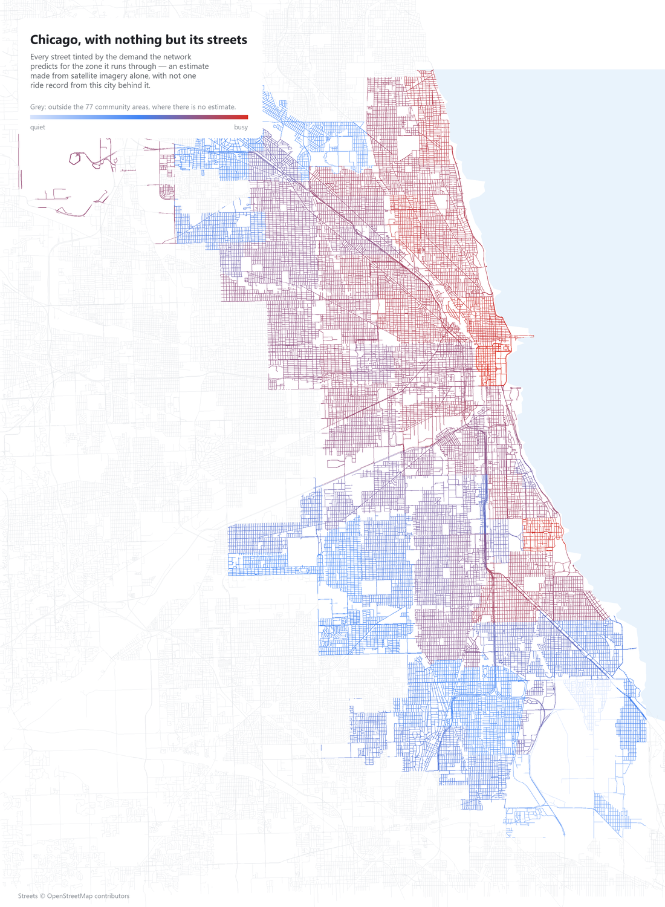

# Sightline `v0.1`

**A city you have never operated in has no ride data. It does have satellite imagery.**

Trained on New York, then handed Chicago — a city it had never seen, in any
form. It ranked all 77 of Chicago's neighbourhoods by ride demand at
**Spearman ρ 0.88**, from nothing but free satellite pixels, and beat an
OpenStreetMap road-density baseline on every measure (ρ 0.88 against 0.50).

What it cannot do is name the absolute numbers — those depend on the market, not
on the ground — and **one zone** of real local demand fixes that, halving the
error. So the practical claim is: *a satellite and one neighbourhood, instead of
a pilot.*

### ▶ [Open the interactive map](https://mathieutellene.github.io/sightline/)

Click any Chicago neighbourhood and watch its satellite chip pass through the
network, block by block, to the estimate that comes out — computed in your own
browser, from the weights, with no server.


Entering a new market, the question is always the same: *where inside this city
do the rides come from?* The answer normally costs a pilot — months of operating
at a loss to find out. Meanwhile a satellite has photographed every street in
that city, for free, every five days, for a decade.

So: train a convolutional network on satellite imagery in a city where the
answer is published, and ask it about a city it has never seen.

> Early version. The pipeline, the model and the transfer experiment all run end
> to end on open data; the roadmap at the bottom is what v0.2 is for.

---

## What it actually does

One 1.28 km square of ground goes in. Four convolutional blocks later, a number
comes out. Everything below is a real activation captured from the trained
weights, not an illustration — `scripts/export_visuals.py` writes them.


Resolution falls at every step — 64², 32², 16², 8² — while the number of
channels climbs. The last block's 128 numbers are what become the estimate.

### It runs in your browser, not on a server

Everything above was computed in Python and shipped as images, which proves what
the model did once on a machine you cannot inspect. So the
[live page](https://mathieutellene.github.io/sightline/) also ships the weights
and does the arithmetic in front of you: press the button and your own browser
runs the forward pass, filling in each block's feature maps as it computes them.

There is no runtime to download and no inference API to call. The model is eight
convolutions, a ReLU after each, an average and two matrix multiplies — so
executing it is less code than any library that could execute it:
[`docs/net.js`](docs/net.js) is 120 lines against several megabytes of wasm.
`scripts/export_weights.py` folds each BatchNorm into the convolution before it,
which is exact at eval time and removes a whole layer type from the JavaScript,
then writes the 590,497 parameters as raw float32 for the browser to map
straight into a `Float32Array`.

Checked against PyTorch on three zones: the browser's log10 output differs by
**0.000000**, in about 500 ms.

That check is why the chips ship as lossless PNG at their native 128 px rather
than the crisper-looking 384 px JPEG they used to be. The browser has to run the
network on exactly those pixels, and the JPEG round trip was measured moving
predictions by as much as **26%** — enough for the page and Python to visibly
disagree. The PNG is also the smaller file.

---

## Watching it learn

Supervised learning is a loop: guess, compare against a published answer, adjust.
217 New York zones supply the answers; 38 more are held back to decide when to
stop. Every epoch was kept, so here are all sixty of them.



At epoch 1 the network returns nearly the same number for every zone — a flat
line of dots, the safest guess available before it has learned anything. The
cloud rotates onto the diagonal only where there is an answer to be corrected
towards. Chicago, on the right, is never corrected; it is simply run through the
same weights at the same moments, and you can watch it stay parallel to the
diagonal but below it the whole way.

The same four moments, held still:


And the interesting part is what happens to each half of the problem as training
goes on:


| after epoch 5 | value | spread (σ) |
|---|---|---|
| Chicago rank ρ | ≈ 0.88 | **0.005** |
| Chicago R² | wanders | **0.219** |

**The ordering is learned in three epochs and then never changes.** ρ is 0.76
after a single pass and 0.88 by the third, and across the remaining 55 epochs it
moves by a standard deviation of half a percentage point. The level, measured on
the very same forward passes, swings between −37.5 and +0.63 and never settles.

That is the headline result of this repository showing up as a *dynamic* rather
than a number: one half of the problem is in the imagery and is found almost
immediately; the other half is not in the imagery at all, and sixty epochs of
gradient descent cannot conjure it.

It also names a trap. Chicago's R² peaks at +0.63 at epoch 15 — far better than
the +0.23 reported here. Shipping that epoch would mean choosing a model by how
it scored on the test city, which is how a held-out city stops being held out.
The epoch that ships is chosen on New York's validation split and nothing else.

---

## The result

Trained on 255 New York zones. Tested on **77 Chicago zones the network never
saw, in a city it was never shown**.

| | R² | Spearman ρ | median error |
|---|---|---|---|
| New York — held-out zones, same city | +0.84 | 0.93 | ×1.28 |
| **Chicago — never seen** | **+0.23** | **0.88** | **×2.65** |

Read those two rows carefully, because they do not say the same thing.

**The ordering transfers almost intact.** ρ falls from 0.93 to 0.88. Shown a
city it has never encountered, the model still knows which zones are busier than
which — and ranking is what a market-entry decision actually consumes.

**The level does not transfer at all.** R² collapses and the typical prediction
is off by a factor of 2.65.


That failure is not mysterious, and it is not fixable with a bigger network. New
York runs at a median of 743 trips/km²/day; Chicago at 128. That **5.8× gap** is
how enthusiastically each city has adopted ride-hailing — a property of the
market, its taxi regulation and its transit system. **No number of rooftops
encodes it.** Asking pixels for it is asking the wrong source.

It is worth being exact about which of the two possible failures this is, since
they look identical from a single number and call for opposite responses.

| | a model too weak for the task | information absent from the input |
|---|---|---|
| The size of the error | arbitrary | 2.65×, inside the 5.8× the two markets differ by |
| During training | both halves improve slowly together | ρ solved by epoch 3 (σ 0.005), R² never converges (σ 0.219) |
| Effect of one scalar offset | nothing — a broken shape stays broken | R² 0.23 → **0.53**, error halved |
| Against the obvious baseline | loses | wins on every column |

All four say the same thing. **A single number cannot rescue a bad model**; that
it does here is the proof that the shape was right and only the scale was
missing — which is a finding about the world, not a shortfall in the network.

---

## What the network actually learned

Put a busy zone and a quiet one through the same filters. Each tile holds the
same channel in both rows and is scaled against the same anchor measured over
all 77 zones, so a fainter tile really is a fainter response.


Read the bottom row of numbers left to right. Correlate how hard each block's
tiles fire with the demand the zone really has, and the answer **changes sign on
the way down**:

| | block 1 | block 2 | block 3 | block 4 |
|---|---|---|---|---|
| response vs log demand | **+0.84** | **+0.82** | −0.34 | **−0.77** |

The early blocks answer to *busy* — edges, texture, the density of built things.
By the fourth, the filters have learned to fire on **emptiness**: vegetation,
open ground, bare lots. Heavy demand is not what lights them up, it is what
silences them. Hegewisch, the quietest of the 77 zones, ends up with the loudest
final block in the set.

This is measured in `scripts/export_visuals.py` and written into the data the
page reads, not asserted here — so it cannot quietly stop being true if the
model is retrained.

### Where it was actually looking

Feature maps show what the network **computed**. They do not show what it
**used**: a channel can light up brilliantly over something that made no
difference to the answer. Occlusion answers the harder question directly — cover
a 240 m square of the chip with flat grey, run the whole network again, and see
how far the estimate moves. A patch that mattered leaves a hole in the answer.



196 probes per zone, no gradients and no heuristics: every pixel above is a real
prediction the model made with one square of the world hidden
(`scripts/export_saliency.py`). Red means covering it *lowered* the estimate —
the network was reading demand there. Blue means covering it *raised* it.

Look at Hegewisch on the right. The blue sits **exactly on the open ground**, and
it arrives independently of the channel-response numbers above: two different
measurements, one looking at activations and one at predictions, agreeing that
this network reads demand from the absence of emptiness.

On the [live page](https://mathieutellene.github.io/sightline/) that map is
clickable. Pick a square yourself and your browser covers it and re-runs the
network — covering Hegewisch's open ground takes the estimate from 68 to 82,
**21% higher**, computed on your machine while you watch.

Full scale is only ×1.11, shared across all 77 zones, and that is worth reading
too: no single patch carries a zone. The network integrates over the whole
square rather than finding one landmark.

---

## "Why not just use OpenStreetMap?"

The obvious objection to all of this is that imagery is a roundabout way of
measuring urban density, and OSM hands that over directly and for free. That
deserves a number rather than a paragraph, so `scripts/score_baseline.py` runs
the identical evaluation on the road network instead of the pixels: same zones,
same 1.28 km squares, same log10 target, same train-on-New-York split, same four
metrics. Ridge regression on metres of street, arterial share, junctions and
segment count, with the penalty chosen on New York alone.

| on Chicago, never seen | R² | rank ρ | median error |
|---|---|---|---|
| OpenStreetMap road network — 4 features | −0.77 | 0.50 | ×3.17 |
| **Satellite imagery — 49,152 pixels** | **+0.23** | **0.88** | **×2.65** |

Beaten on every column, and the gap is widest on the ordering, which is the part
a market-entry decision actually uses.

Two things worth saying plainly rather than leaving for someone else to point
out. Road density is weak here **even in the city it was fitted on** — ρ 0.61 on
New York, against the network's 0.93. And this is four road features, not all of
OpenStreetMap: building footprints and points of interest would likely do
better, and were left out because fetching them was measured at thirty seconds
per zone. So the claim is the narrow one — *the most complete and universally
available part of OSM does not carry the ordering, and the pixels do* — which is
the part that matters for a city whose map is thin.

---

## The map a city gets before it has any data of its own

The same OpenStreetMap network that supplies the baseline also draws this.
Chicago as nothing but its streets, each one tinted by the demand the network
predicts for the zone it runs through.



Not one ride record from this city went into a single colour. The Loop burns,
the North Side runs warm, the South and West sides cool — an ordering the trip
data agrees with at ρ 0.88, from a network that has never seen a Chicago trip.
68,416 streets, 14,713 km. Grey is outside the 77 community areas, where there
is no estimate to draw.

---

## So how much local data does it take to fix the level?

The shape is already right and only the level is wrong, so the fix is one
number. Fit a single scalar offset on *k* zones where real demand is known,
score the rest, repeat over 400 random draws of which *k* zones you happen to
get (`sightline/calibrate.py`):

| zones with real data | R² | median error |
|---|---|---|
| none | +0.23 | ×2.65 |
| **1** | **+0.53** | **×1.61** |
| 3 | +0.56 | ×1.45 |
| 5 | +0.58 | ×1.44 |
| 21 | +0.60 | ×1.42 |

**One zone.** A single day of real demand in a single neighbourhood takes R²
from 0.23 to 0.53 and halves the error. Three gets most of what twenty-one does,
and past five the curve is flat.

A flat curve is only good news if it flattens somewhere good, so here is the
bound it should be read against. Fit the offset with **all 77 of Chicago's
answers in hand** — cheating, not a result — and the best any correction
achieves is **×1.37**. Three zones reach ×1.45. *Three neighbourhoods get you
within four percent of knowing the whole city.*

And the obvious refinement does not work. The scatter looks squeezed towards the
middle, which invites a second parameter to stretch it back out; fitting slope
as well as offset is **worse at every k** (×1.77 against ×1.45 at three zones,
×1.56 against ×1.42 at twenty-one), and the best slope with every answer visible
is 1.05 — that is, none. One scalar is not a simplification here, it is the
right model, and `sightline/calibrate.py` measures that rather than assuming it.

That is the practical claim of this repository: *you do not need a market study
to know where the demand is. You need a satellite and one zone.*

### How far off is it, really

Worth being blunt, because a median hides the tail:

| uncalibrated, on Chicago | |
|---|---|
| typical (median) error | ×2.65 |
| 90th percentile | ×4.36 |
| worst zone | ×10.92 |
| zones within ×2 of truth | **31%** |

As absolute numbers these are not usable — you would not size a fleet with them.
Two things make that a bounded problem rather than a fatal one.

**The error is one-directional, not noise.** The network over-calls Chicago
nearly everywhere — ×3.1 in the quiet third, ×2.9 in the middle, ×1.25 in the
busy third. That is New York's scale showing through, which is exactly what a
single offset removes.

**And the distortion is specific to the transfer.** Regress predicted on
measured inside New York and the slope is **0.97** — no compression at all. Do
it on Chicago and it is 0.51. The model is not squashing its output; it is being
asked to place a city whose scale it was never shown.

Even fully calibrated the floor is ×1.42. If it says 1,000, the truth is
somewhere near 700 to 1,400. That is a tool for deciding **where first**, not
for deciding how many cars.

---

## How it works

**The target.** Both cities publish every trip. New York ships a 437 MB parquet
per month; only the pickup-zone column is ever read, which a range request pulls
in 18 MB. Chicago's Socrata endpoint does the `GROUP BY` server-side. Both are
normalised to **trips per km² per day**, because a Manhattan taxi zone is a few
blocks and a Chicago community area is a neighbourhood — raw counts would mostly
measure who drew the boundary.

**The imagery.** Sentinel-2 L2A, 10 m/px, free and unauthenticated via STAC, at
under 0.2% cloud. Each zone gets one 128 px chip covering a **fixed 1.28 km** of
ground, centred on the zone centroid. Fixed ground extent rather than fixed zone
is deliberate: a convolutional network cannot recover scale from pixels, so
feeding it whole zones would show it a Manhattan block and a Chicago
neighbourhood at the same pixel size and invite it to conclude they are alike.

**The network.** Four convolutional blocks, 591k parameters, trained from
scratch on CPU in under five minutes. No pretrained backbone — the question is
what *this* imagery carries, and an ImageNet backbone would blend that with
whatever it already knows about photographs. Augmentation is the eight-fold
dihedral group only: a satellite chip has no canonical orientation, so flips and
90° rotations are free label-preserving data. Colour jitter is deliberately
excluded, since brightness here is sun angle and atmosphere, and a bright bare
roof really is different from dark asphalt.

**The split.** New York is used only to fit and to stop early. A random hold-out
inside one city measures interpolation — adjacent zones share streets, traffic
and everything the satellite sees. The reported number is Chicago.

---

## Run it

```bash
python -m venv .venv
.venv/Scripts/pip install -r requirements.txt    # Linux/macOS: .venv/bin/pip

python -m sightline.zones        # fetch both cities' geography
python -m sightline.demand       # build the target from open trip data
python -m sightline.tiles        # cut one satellite chip per zone (~15 MB cached)
python -m sightline.train        # train on NYC, test on Chicago  (~5 min, CPU)
python -m sightline.calibrate    # the calibration curve above

python scripts/export_visuals.py # everything the web page shows
python scripts/export_weights.py # the weights the browser runs
python scripts/export_saliency.py # occlusion maps: where it was looking
python scripts/score_baseline.py # the OpenStreetMap comparison (fetches OSM)
python scripts/make_figures.py   # every figure in this README
```

Everything is cached under `data/`, so the second run of anything is instant.
No API keys anywhere: every source is open.

The trained weights are committed (`data/runs/`, 2.3 MB), so the last two steps
run on a fresh clone without retraining — and the figures stay tied to the exact
model that produced the scores above rather than to a later re-run of it. The
downloads and chips are not committed; they are large and every byte of them is
reproducible from the steps above.

The last two steps are what keep this file honest. They re-run the trained
network over every Chicago zone, capture the activation after each block, and
draw the pictures above from those captures and from the measured metrics —
nothing in this README is a screenshot or a diagram drawn by hand. Delete
`docs/figures/` and one command puts it back.

---

## What is real and what is not

| | |
|---|---|
| Trip counts, both cities | **Real**, from each city's own published feed |
| Satellite imagery | **Real** Sentinel-2, contemporaneous with the trip data — June 2022 for both, because that is the most recent month Chicago publishes. Predicting 2022 demand from 2026 imagery would leak four years of construction into the features |
| The feature maps | **Real** activations, captured from the trained weights. Each is stretched for display against a per-channel anchor measured across the whole test set, so brightness is comparable between zones |
| The transfer result | **Measured**, on a city held out entirely — not a random split |
| The calibration curve | **Measured** over 400 random draws per *k*, median reported |
| The OSM comparison | **Measured** on the same zones and split, with the ridge penalty chosen on New York only |
| The street map | **Real** OpenStreetMap geometry; the colours are the model's predictions, not measurements |
| Lake Michigan on the map | **Drawn**, not surveyed. The community-area boundaries stop at the shoreline, so the water is reconstructed from their eastern edge, and the Indiana stretch south of the city is a straight approximation |

---

## Limitations

- **A 1.28 km chip does not see a whole large zone.** For zones bigger than that
  the model looks at the core and infers the rest. Chicago's community areas
  have a median of 7.4 km²; New York's taxi zones, 2.1.
- **Two cities is not a validation set.** One transfer result is evidence, not a
  law. The honest version of this claim needs five cities, and every extra city
  is a new open-data format to parse.
- **Both cities are American**, dense, grid-planned and heavily transit-served.
  Whether this transfers to a European or Latin American city is unknown and
  should not be assumed.
- **The model sees one cloud-free summer day.** Demand has a season and a
  weekday/weekend shape; none of that is modelled here.
- **10 m/px** is what free imagery gives. Cars, people and building detail are
  invisible at that resolution — this can only read urban form.

## Roadmap to v0.2

- **A richer OSM baseline.** The road-network one above is answered; building
  footprints, points of interest and land use are not in it, and they are the
  features most likely to close the gap. The cost is the reason: Overpass was
  measured at thirty seconds per zone for building geometry. A bulk extract
  rather than an API would make it cheap.
- A third and fourth city, to see whether ρ ≈ 0.88 holds or New York and Chicago
  simply happen to resemble each other.
- Near-infrared. The current chips are 8-bit RGB; Sentinel-2 also ships NIR at
  10 m, which separates vegetation from bare ground far better than any
  visible-band combination — and given what the deep blocks turned out to key
  on, that is the most promising single change on this list.

---

## License

MIT. Trip data © NYC TLC and the City of Chicago under their respective open
data terms. Sentinel-2 imagery © ESA/Copernicus, free and open.
