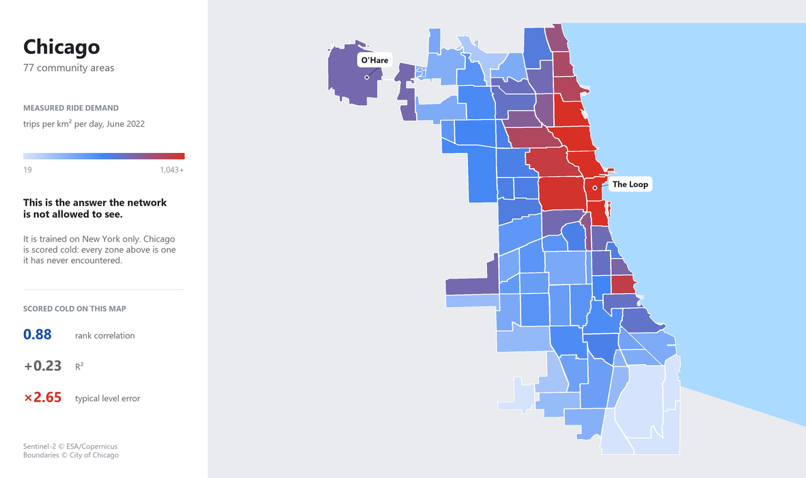
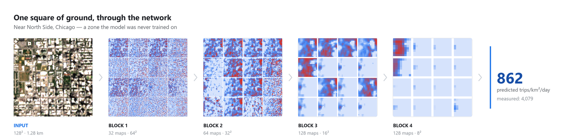
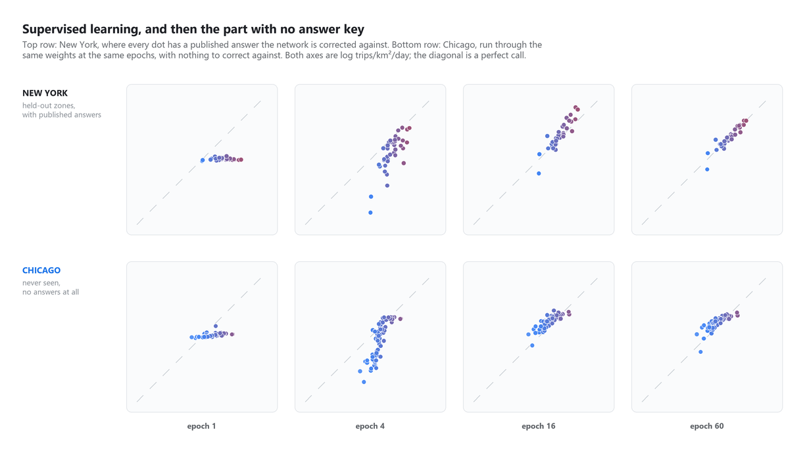
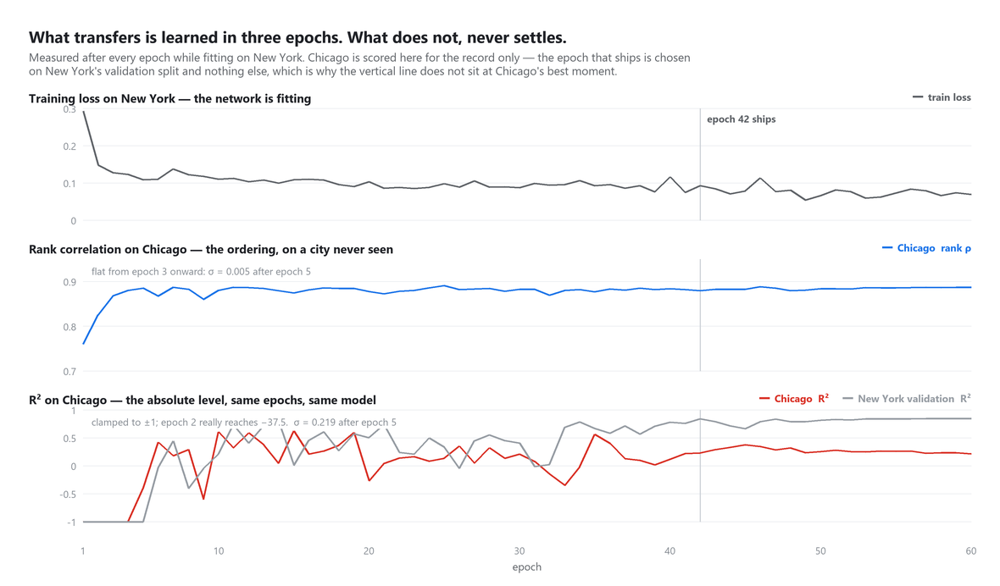
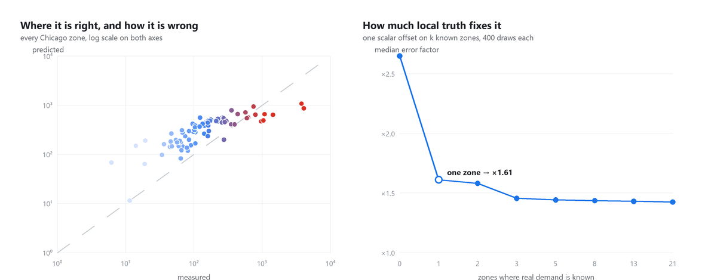
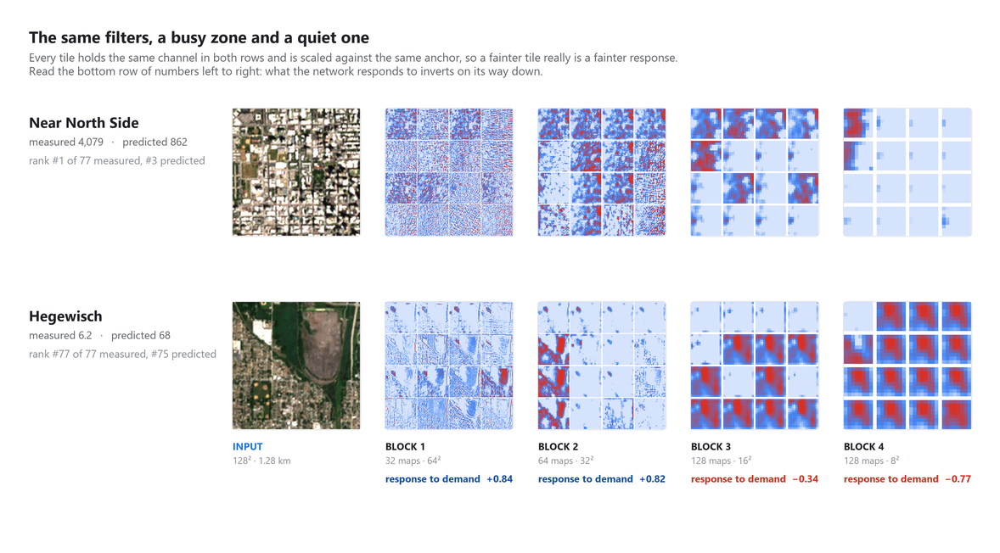

# Sightline `v0.1`

**A city you have never operated in has no ride data. It does have satellite imagery.**

### ▶ [Open the interactive map](https://mathieutellene.github.io/sightline/)

Click any Chicago neighbourhood and watch its satellite chip pass through the
network, block by block, to the estimate that comes out.



Entering a new market, the question is always the same: *where inside this city
do the rides come from?* The answer normally costs a pilot — months of operating
at a loss to find out. Meanwhile a satellite has photographed every street in
that city, for free, every five days, for a decade.

So: train a convolutional network on satellite imagery in a city where the
answer is published, and ask it about a city it has never seen.

> Early version. The pipeline, the model and the transfer experiment all run end
> to end on open data; the roadmap at the bottom is what v0.2 is for.

---

## What it actually does

One 1.28 km square of ground goes in. Four convolutional blocks later, a number
comes out. Everything below is a real activation captured from the trained
weights, not an illustration — `scripts/export_visuals.py` writes them.



Resolution falls at every step — 64², 32², 16², 8² — while the number of
channels climbs. The last block's 128 numbers are what become the estimate.

---

## Watching it learn

Supervised learning is a loop: guess, compare against a published answer, adjust.
217 New York zones supply the answers; 38 more are held back to decide when to
stop. The figure below is the same four epochs on the city that has answers and
the city that does not.



At epoch 1 the network returns nearly the same number for every zone — a flat
line of dots, the safest guess available before it has learned anything. The
cloud rotates onto the diagonal only where there is an answer to be corrected
towards. Chicago, in the bottom row, is never corrected; it is simply run
through the same weights at the same moments.

And the interesting part is what happens to each half of the problem as training
goes on:



| after epoch 5 | value | spread (σ) |
|---|---|---|
| Chicago rank ρ | ≈ 0.88 | **0.005** |
| Chicago R² | wanders | **0.219** |

**The ordering is learned in three epochs and then never changes.** ρ is 0.76
after a single pass and 0.88 by the third, and across the remaining 55 epochs it
moves by a standard deviation of half a percentage point. The level, measured on
the very same forward passes, swings between −37.5 and +0.63 and never settles.

That is the headline result of this repository showing up as a *dynamic* rather
than a number: one half of the problem is in the imagery and is found almost
immediately; the other half is not in the imagery at all, and sixty epochs of
gradient descent cannot conjure it.

It also names a trap. Chicago's R² peaks at +0.63 at epoch 15 — far better than
the +0.23 reported here. Shipping that epoch would mean choosing a model by how
it scored on the test city, which is how a held-out city stops being held out.
The epoch that ships is chosen on New York's validation split and nothing else.

---

## The result

Trained on 255 New York zones. Tested on **77 Chicago zones the network never
saw, in a city it was never shown**.

| | R² | Spearman ρ | median error |
|---|---|---|---|
| New York — held-out zones, same city | +0.84 | 0.93 | ×1.28 |
| **Chicago — never seen** | **+0.23** | **0.88** | **×2.65** |

Read those two rows carefully, because they do not say the same thing.

**The ordering transfers almost intact.** ρ falls from 0.93 to 0.88. Shown a
city it has never encountered, the model still knows which zones are busier than
which — and ranking is what a market-entry decision actually consumes.

**The level does not transfer at all.** R² collapses and the typical prediction
is off by a factor of 2.65.



That failure is not mysterious, and it is not fixable with a bigger network. New
York runs at a median of 744 trips/km²/day; Chicago at 128. That six-fold gap is
how enthusiastically each city has adopted ride-hailing — a property of the
market, its taxi regulation and its transit system. **No number of rooftops
encodes it.** Asking pixels for it is asking the wrong source.

---

## What the network actually learned

Put a busy zone and a quiet one through the same filters. Each tile holds the
same channel in both rows and is scaled against the same anchor measured over
all 77 zones, so a fainter tile really is a fainter response.



Read the bottom row of numbers left to right. Correlate how hard each block's
tiles fire with the demand the zone really has, and the answer **changes sign on
the way down**:

| | block 1 | block 2 | block 3 | block 4 |
|---|---|---|---|---|
| response vs log demand | **+0.84** | **+0.82** | −0.34 | **−0.77** |

The early blocks answer to *busy* — edges, texture, the density of built things.
By the fourth, the filters have learned to fire on **emptiness**: vegetation,
open ground, bare lots. Heavy demand is not what lights them up, it is what
silences them. Hegewisch, the quietest of the 77 zones, ends up with the loudest
final block in the set.

This is measured in `scripts/export_visuals.py` and written into the data the
page reads, not asserted here — so it cannot quietly stop being true if the
model is retrained.

---

## So how much local data does it take to fix the level?

The shape is already right and only the level is wrong, so the fix is one
number. Fit a single scalar offset on *k* zones where real demand is known,
score the rest, repeat over 400 random draws of which *k* zones you happen to
get (`sightline/calibrate.py`):

| zones with real data | R² | median error |
|---|---|---|
| none | +0.23 | ×2.65 |
| **1** | **+0.53** | **×1.61** |
| 3 | +0.56 | ×1.45 |
| 5 | +0.58 | ×1.44 |
| 21 | +0.60 | ×1.42 |

**One zone.** A single day of real demand in a single neighbourhood takes R²
from 0.23 to 0.53 and halves the error. Three gets most of what twenty-one does,
and past five the curve is flat — more local data stops buying anything, because
what remains is not level error any more.

That is the practical claim of this repository: *you do not need a market study
to know where the demand is. You need a satellite and one zone.*

---

## How it works

**The target.** Both cities publish every trip. New York ships a 437 MB parquet
per month; only the pickup-zone column is ever read, which a range request pulls
in 18 MB. Chicago's Socrata endpoint does the `GROUP BY` server-side. Both are
normalised to **trips per km² per day**, because a Manhattan taxi zone is a few
blocks and a Chicago community area is a neighbourhood — raw counts would mostly
measure who drew the boundary.

**The imagery.** Sentinel-2 L2A, 10 m/px, free and unauthenticated via STAC, at
under 0.2% cloud. Each zone gets one 128 px chip covering a **fixed 1.28 km** of
ground, centred on the zone centroid. Fixed ground extent rather than fixed zone
is deliberate: a convolutional network cannot recover scale from pixels, so
feeding it whole zones would show it a Manhattan block and a Chicago
neighbourhood at the same pixel size and invite it to conclude they are alike.

**The network.** Four convolutional blocks, 591k parameters, trained from
scratch on CPU in under five minutes. No pretrained backbone — the question is
what *this* imagery carries, and an ImageNet backbone would blend that with
whatever it already knows about photographs. Augmentation is the eight-fold
dihedral group only: a satellite chip has no canonical orientation, so flips and
90° rotations are free label-preserving data. Colour jitter is deliberately
excluded, since brightness here is sun angle and atmosphere, and a bright bare
roof really is different from dark asphalt.

**The split.** New York is used only to fit and to stop early. A random hold-out
inside one city measures interpolation — adjacent zones share streets, traffic
and everything the satellite sees. The reported number is Chicago.

---

## Run it

```bash
python -m venv .venv
.venv/Scripts/pip install -r requirements.txt    # Linux/macOS: .venv/bin/pip

python -m sightline.zones        # fetch both cities' geography
python -m sightline.demand       # build the target from open trip data
python -m sightline.tiles        # cut one satellite chip per zone (~15 MB cached)
python -m sightline.train        # train on NYC, test on Chicago  (~5 min, CPU)
python -m sightline.calibrate    # the calibration curve above

python scripts/export_visuals.py # everything the web page shows
python scripts/make_figures.py   # every figure in this README
```

Everything is cached under `data/`, so the second run of anything is instant.
No API keys anywhere: every source is open.

The trained weights are committed (`data/runs/`, 2.3 MB), so the last two steps
run on a fresh clone without retraining — and the figures stay tied to the exact
model that produced the scores above rather than to a later re-run of it. The
downloads and chips are not committed; they are large and every byte of them is
reproducible from the steps above.

The last two steps are what keep this file honest. They re-run the trained
network over every Chicago zone, capture the activation after each block, and
draw the pictures above from those captures and from the measured metrics —
nothing in this README is a screenshot or a diagram drawn by hand. Delete
`docs/figures/` and one command puts it back.

---

## What is real and what is not

| | |
|---|---|
| Trip counts, both cities | **Real**, from each city's own published feed |
| Satellite imagery | **Real** Sentinel-2, contemporaneous with the trip data — June 2022 for both, because that is the most recent month Chicago publishes. Predicting 2022 demand from 2026 imagery would leak four years of construction into the features |
| The feature maps | **Real** activations, captured from the trained weights. Each is stretched for display against a per-channel anchor measured across the whole test set, so brightness is comparable between zones |
| The transfer result | **Measured**, on a city held out entirely — not a random split |
| The calibration curve | **Measured** over 400 random draws per *k*, median reported |
| Lake Michigan on the map | **Drawn**, not surveyed. The community-area boundaries stop at the shoreline, so the water is reconstructed from their eastern edge, and the Indiana stretch south of the city is a straight approximation |

---

## Limitations

- **A 1.28 km chip does not see a whole large zone.** For zones bigger than that
  the model looks at the core and infers the rest. Chicago's community areas
  have a median of 7.4 km²; New York's taxi zones, 2.1.
- **Two cities is not a validation set.** One transfer result is evidence, not a
  law. The honest version of this claim needs five cities, and every extra city
  is a new open-data format to parse.
- **Both cities are American**, dense, grid-planned and heavily transit-served.
  Whether this transfers to a European or Latin American city is unknown and
  should not be assumed.
- **The model sees one cloud-free summer day.** Demand has a season and a
  weekday/weekend shape; none of that is modelled here.
- **10 m/px** is what free imagery gives. Cars, people and building detail are
  invisible at that resolution — this can only read urban form.

## Roadmap to v0.2

- **The OSM baseline** (`sightline/baseline.py`, built but not yet scored). The
  obvious objection is that imagery is a roundabout way of measuring density,
  and OpenStreetMap hands that over directly. That objection deserves a number.
  The interesting case is where the two disagree: OSM is excellent in mature
  cities and thin almost everywhere else, which is exactly where a satellite
  keeps working.
- A third and fourth city, to see whether ρ ≈ 0.88 holds or New York and Chicago
  simply happen to resemble each other.
- Near-infrared. The current chips are 8-bit RGB; Sentinel-2 also ships NIR at
  10 m, which separates vegetation from bare ground far better than any
  visible-band combination — and given what the deep blocks turned out to key
  on, that is the most promising single change on this list.

---

## License

MIT. Trip data © NYC TLC and the City of Chicago under their respective open
data terms. Sentinel-2 imagery © ESA/Copernicus, free and open.
